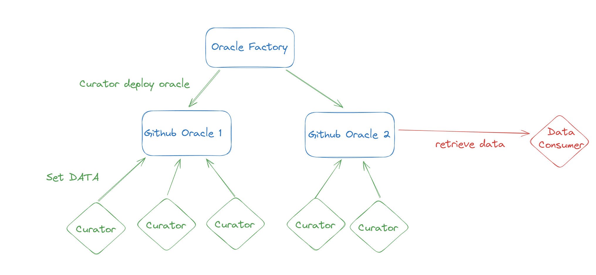

# gno-oracle

## Description

A gno oracle aiming to provide general data to the blockchain without relying a on a decentralized set of nodes that comes to a consensus like chainlink.

This type of oracle comes with a big tradeoff, you need to trust the data provider(s) to provide accurate data as a slahing mechanism is not feasable because most of the time we cannot know historical data.

There are two different actors in the system:
- Curators: They are responsible for providing data to the oracle.
- Data consumers: They are the users who want to access the data provided by the oracle.

To improve a bit the trustness of the data, multiple sets of curators can be used to provide the same data, and the data consumers can choose which set of curators to trust.

## How it works

## Agents

Exemple of agents that can be used to provide data to the oracle will be created in the `agents` folder.
With an implementation in go and another one in typescript to ease the integration of curators.
